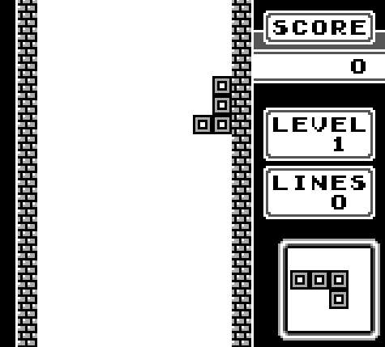

# Game Boy Emulator
 
A Nintendo Game Boy emulator written from scratch in C++.
 

 
Tetris is fully playable. The project implements the original Game Boy hardware at a low level - CPU, memory, PPU, interrupts, and cartridge banking - without using any emulation libraries.
 
---
 
## Features
 
- **SM83 CPU** - full instruction set including all opcodes, flags, interrupts, halt, and EI/DI timing
- **PPU** - scanline-accurate background, window, and sprite rendering with palette support
- **MBC1, MBC3, MBC5** cartridge support - ROM banking, RAM banking, enabling games like Zelda: Link's Awakening
- **OAM DMA** transfers
- **Timer** with interrupt generation (DIV, TIMA, TMA, TAC)
- **Joypad** input with interrupt support
- **60fps** frame timing via SDL2
---
 
## Controls
 
| Key | Game Boy Button |
|-----|----------------|
| Arrow Keys | D-Pad |
| Z | A |
| X | B |
| Enter | Start |
| Left/Right Shift | Select |
 
---
 
## Building
 
Requires Visual Studio and SDL2.
 
1. Clone the repo and open `GameboyEmulator.sln`
2. Set build to **Release** for full speed
3. Run with a ROM:
```
GameboyEmulator.exe path\to\rom.gb
```
 
---
 
## How it works
 
The emulator models the original Game Boy hardware cycle by cycle:
 
- The **SM83 CPU** runs one instruction at a time - fetch, decode, execute, repeat. Flags and registers behave exactly like the real chip
- The **MMU** sits in the middle of everything and figures out where a read or write actually needs to go - ROM, WRAM, VRAM, OAM, I/O, HRAM...
- The **PPU** draws the screen one scanline at a time, cycling through OAM scan → pixel transfer → HBlank, then VBlank once all 144 lines are done. The finished frame gets pushed to SDL2
- **Interrupts** work properly - VBlank, LCD STAT, Timer and Joypad all go through the IE/IF registers and wake the CPU at the right time
- **Cartridge mappers** (MBC1/3/5) handle bank switching so bigger games can actually load their data
---
 
## TODO
 
- [ ] Sound (APU — 4 channel audio)
- [ ] Save states (F5/F8)
- [ ] Fullscreen toggle (F11)
- [ ] Game Boy Color (CGB) support
- [ ] More MBC types
